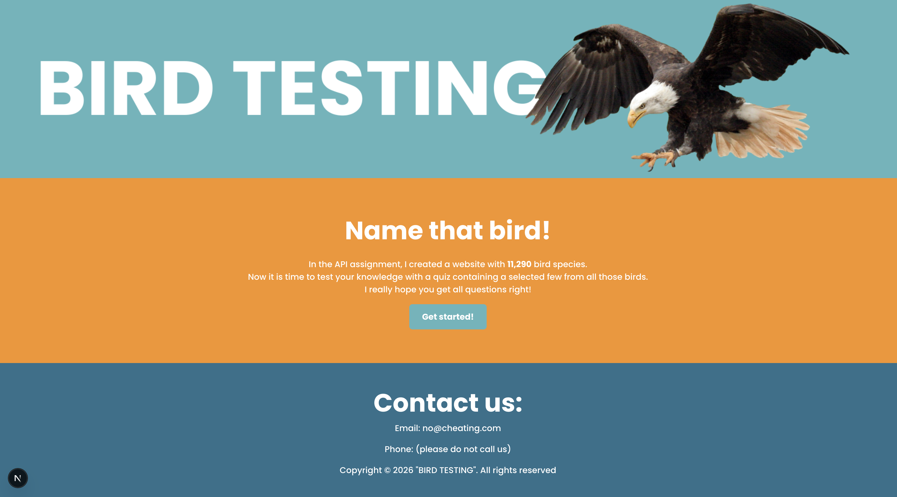
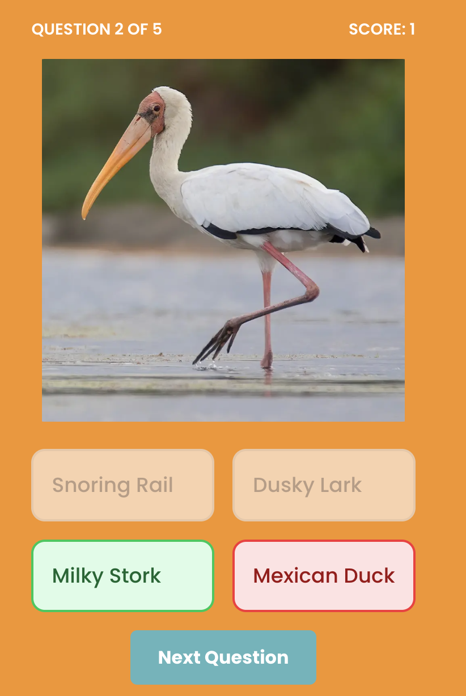
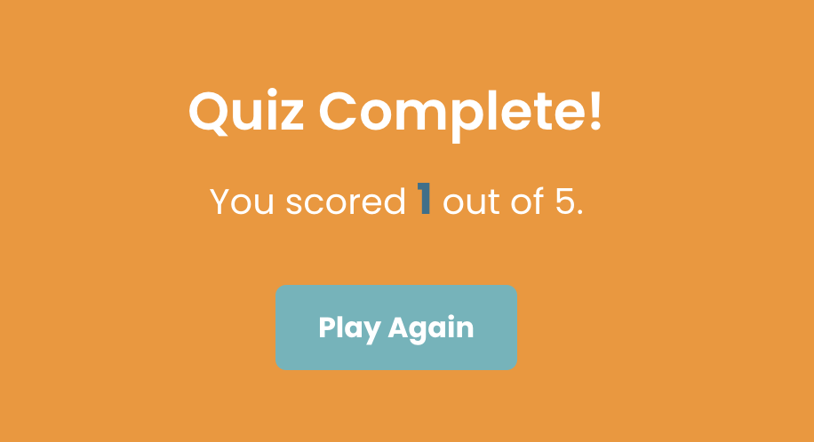

## About

In the API assignment, I created a website with 11,290 bird species. Now it is time to test your knowledge with a quiz containing a selected few from all those birds. I really hope you get all questions right!

## How the website works:

The website has a main page with a header, footer and a short introduction. The introduction contains a button to start the bird quiz. 

When clicking the "Get started" button, the quiz are supposed to start where you will see an image of an bird and have four options to pick from. When clicked on an option, it should display if the answer was right or wrong and also show the correct answer. 

The quiz also displays how many total questions there are as well as your score. 

When you have answered al five questions, a button saying "See results" will show up. When clicked, it will display your score. From the score section, you can also choose to play the quiz again. By clicking "Play again", you will be taken to the introduction section again, where you can click "Get started".

That is all (I think...)!
